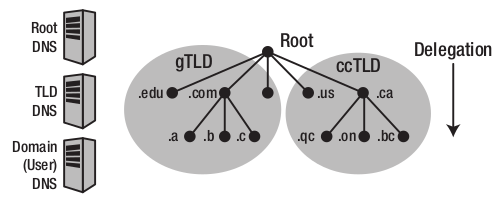
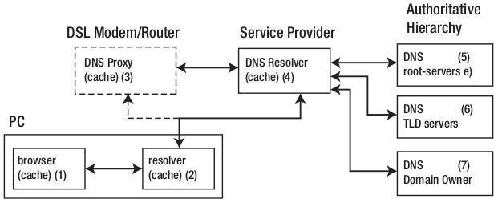
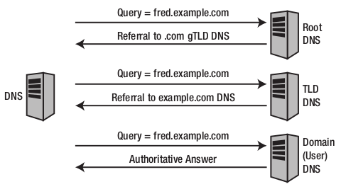

Domain Name System (DNS)
========================

:Autores: Maximiliano Boscovich (maximiliano@boscovich.com.ar)

          Emiliano López (emiliano.lopez@gmail.com)

:Fecha: |date| |time|

.. |date| date:: %d/%m/%Y
.. |time| date:: %H:%M

.. header::
  Curso Administracion GNU/Linux

.. footer::
    ###Page### / ###Total###

.. contents:: Tabla de contenidos

.. sectnum::

.. raw:: pdf

   PageBreak oneColumn

El protocolo DNS
----------------

DNS (acrónimo de Domain Name System) es una base de datos distribuida y
jerárquica, que almacena la información necesaria para los nombres de dominio.
Sus usos principales son la asignación de nombres de dominio a direcciones IP y
la localización de los servidores de correo electrónico correspondientes para
cada dominio. El DNS nació de la necesidad de facilitar a los seres humanos el
acceso hacia los servidores disponibles a través de Internet permitiendo hacerlo
por un nombre, algo más fácil de recordar que una dirección IP.

Los Servidores DNS utilizan TCP y UDP, en el puerto 53 para responder las
consultas. Casi todas las consultas consisten de una sola solicitud UDP desde
un Cliente DNS, seguida por una sola respuesta UDP del servidor. Se realiza una
conexión TCP cuando el tamaño de los datos de la respuesta exceden los 512 bytes,
tal como ocurre con tareas como transferencia de zonas.

Implementación y estructura del DNS
-----------------------------------

El DNS usa una estructura de nombres de árbol (o jerárquica). En el tope del árbol están los 
nodos raíz, seguidos por los **Top-Level Domains (TLDs)**, luego por los **Second-Level Domains (SLDs)**,
y luego cualquier número de niveles inferiores separados por puntos. 

Los TLDs se dividen en dos tipos, *generic TLDs (gTLD)* y los *country code TLDs (ccTLD)* tal como se observa
en la siguiente figura.

.. note::

  **Autoridad de dominio y delegación**: Cada nodo dentro de una jerarquía de dominios es asignado a una autoridad, esto es, una organización o persona responsable. La autoridad para un nodo particular a su vez puede delegar autoridad para los niveles 
  inferiores de ese nodo dentro de la jerarquía del nombre de dominio.

Secuencia del proceso de resolución
-----------------------------------

El proceso de resolución de nombres en GNU/Linux la lleva a cabo el ``resolver``
presente en la biblioteca estándar de C (``glibc``) fundamentalmente 
mediante dos funcionalidades ``gethostbyname()`` y ``gethostbyaddr()`` que resuelven
las direcciones IP asociadas a un nombre y viceversa.

Las funciones del resolver leen primeramente el contenido del archivo ``/etc/host.conf``
o ``/etc/nsswitch.conf`` donde se indica qué servicios utilizar y el orden. Para ver
las diferentes configuraciones en detalle vea la guía LNA_

.. _LNA: https://www.safaribooksonline.com/library/view/linux-network-administrators/1565924002/ch06.html

En una configuración estándar los pasos a resolver son: 

- Leer el archivo ``/etc/hosts``
- Buscar en el archivo ``/etc/resolv.conf`` a quién consultar

La secuencia completa se muestra en la siguiente figura para el ejemplo de un pedido desde un 
navegador web:

A continuación veamos como es el modo en que responden los diferentes niveles del árbol DNS para llegar al dominio ``fred.example.com``

ACTIVIDAD 1
-----------

- Instale los manuales (``yum install man-pages-es man-pages-es-extra``)
- Modifique en el archivo ``/etc/hosts`` el nombre para identificar las PCs del laboratorio. Vea la ayuda haciendo ``man hosts``.
- Investigue el contenido del archivo ``/etc/resolv.conf`` y expliquelo, use el ``man resolv.conf``.
- Modifique el contenido de este archivo usando los DNS públicos ``8.8.8.8`` y ``8.8.4.4``
- Reinice el servicio de red (``systemct restart network``) y corrobore si se mantiene el contenido previo
- Modifique el archivo ``/etc/sysconfig/network-scripts/ifcfg-epn0s8`` para agregar los DNS previos usando DNS1=8.8.8.8 y DNS2=8.8.4.4 y reinicie el servicio de red nuevamente. Corrobore el contenido de ``/etc/resolv.conf``.

¿Qué es un NIC (Network Information Center)?
--------------------------------------------

NIC (acrónimo de Network Information Center o Centro de Información sobre la Red)
es una institución encargada de asignar los nombres de dominio en Internet ya
sean nombres de dominio genéricos o por países, permitiendo personas o empresas,
montar sitios de Internet a través de un ISP, mediante un DNS. Es lo que previamente
denominamos como **ccTLDs**. Técnicamente existe
un NIC por cada país en el mundo y cada uno de éstos es responsable por todos los
dominios con la terminación correspondiente a su país. Por ejemplo: NIC.AR es
la entidad encargada de gestionar todos los dominios con terminación .ar, la cual
es la terminación correspondiente asignada a los dominios de Argentina.

La información publicada por los NIC es consultada con la herramienta whois.

Qué es un FQDN (Fully Qualified Domain Name)?
----------------------------------------------

FQDN (acrónimo de Fully Qualified Domain Name o Nombre de Dominio Plenamente
Calificado) es un Nombre de Dominio ambiguo que especifica la posición absoluta
del nodo en el árbol jerárquico del DNS. Se distingue de un nombre regular porque
lleva un punto al final.

Como ejemplo: suponiendo que se tiene un dispositivo cuyo nombre de anfitrión es
«maquina1» y un dominio llamado «dominio.com», el FQDN sería «maquina1.dominio.com.»,
así es que se define de forma única al dispositivo mientras que pudieran existir
muchos anfitriones llamados «maquina1», solamente puede haber uno llamado
«maquina1.dominio.com.». La ausencia del punto al final definiría que se pudiera
tratar solamente de un prefijo, es decir «maquina1.dominio.com» pudiera ser un
dominio de otro más largo como «maquina1.dominio.com.ar».

La longitud máxima de un FQDN es de 255 bytes, con una restricción adicional de
63 bytes para cada etiqueta dentro del nombre del dominio. Solamente se permiten
los caracteres A-Z de ASCII, dígitos y el carácter «-» (guión medio). Sin
distinción de mayúsculas y minúsculas.

Desde 2004, a solicitud de varios países de Europa, existe el estándar IDN
(acrónimo de Internationalized Domain Name) que permite caracteres no-ASCII,
codificando caracteres Unicode dentro de cadenas de bytes dentro del conjunto
normal de caracteres de FQDN. Como resultado, los limites de longitud de los
nombres de dominio IDN dependen directamente del contenido mismo del nombre.

Para resumir: un FQDN es un nombre de anfitrión único con un punto al final.

Componentes de DNS
------------------

El protocolo DNS opera a través de tres componentes: Clientes DNS, Servidores DNS
y Zonas de Autoridad.

Clientes DNS
~~~~~~~~~~~~

Son todos aquellos programas que ejecuta un usuario y que generan peticiones de
consulta para resolver nombres y direcciones IP. Básicamente preguntan por la
dirección IP que corresponde a un nombre determinado. Prácticamente todas las
aplicaciones que requieren definir un nombre de anfitrión entre sus argumentos
se consideran clientes DNS.

Por ejemplo: un cliente SSH —aún siendo cliente de otro protocolo— realiza una
consulta de DNS para determinar la dirección IP de un servidor al cual se va a
conectar.

Servidores DNS
~~~~~~~~~~~~~~

Son servicios que contestan las consultas realizadas por los Clientes DNS. Hay
dos tipos de servidores de nombres:

* Servidor Maestro: También denominado Primario. Obtiene los datos del dominio
  a partir de un archivo alojado en el mismo servidor.

* Servidor Esclavo: También denominado Secundario. Al iniciar obtiene los datos
  del dominio a través de un Servidor Maestro (o primario), realizando un proceso
  denominado transferencia de zona.

Cantidad de servidores para resolver un dominio
^^^^^^^^^^^^^^^^^^^^^^^^^^^^^^^^^^^^^^^^^^^^^^^

Un gran número de problemas de operación de servidores DNS se atribuyen a las
pobres opciones de servidores secundarios para las zona de DNS. De acuerdo al
RFC 2182, el DNS requiere que al menos tres servidores existan para todos los
dominios delegados (o zonas).

Una de las principales razones para tener al menos tres servidores para cada zona,
es permitir que la información de la zona misma esté disponible siempre y de
forma confiable, hacia los Clientes DNS, a través de Internet cuando un servidor
DNS de dicha zona falle, esté fuera de servicio y/o esté inalcanzable.

Contar con múltiples servidores también facilita la propagación de la zona y
mejoran la eficiencia del sistema en general al brindar opciones a los Clientes
DNS si acaso encontraran dificultades para realizar una consulta en un Servidor
DNS. En otras palabras: tener múltiples servidores para una zona permite contar
con redundancia y respaldo, del servicio.

Con múltiples servidores, por lo general uno actúa como Servidor Maestro o
Primario y los demás como Servidores Esclavos o Secundarios. Correctamente
configurados y una vez creados los datos para una zona, es innecesario copiarlos
a cada Servidor Esclavo o Secundario, pues éste se encargará de transferir los
datos de manera automática cada vez que sea necesario.

Tipos de consultas hacia un servidor DNS
^^^^^^^^^^^^^^^^^^^^^^^^^^^^^^^^^^^^^^^^

Los Servidores DNS responden dos tipos de consultas:

* Consultas Iterativas (no recursivas): El cliente hace una consulta al Servidor
  DNS y éste le responde con la mejor respuesta que pueda darse basada sobre su
  caché o en las zonas locales. Si no es posible dar una respuesta, la consulta
  se reenvía hacia otro Servidor DNS repitiéndose este proceso hasta encontrar al
  Servidor DNS que tiene la Zona de Autoridad capaz de resolver la consulta.

* Consultas Recursivas: El Servidor DNS asume toda la carga de proporcionar una
  respuesta completa para la consulta realizada por el Cliente DNS. El Servidor
  DNS desarrolla entonces Consultas Iterativas separadas hacia otros Servidores
  DNS (en lugar de hacerlo el Cliente DNS) para obtener la respuesta solicitada.

Zonas de Autoridad
~~~~~~~~~~~~~~~~~~

Éstas permiten al Servidor Maestro o Primario cargar la información de una zona.
Cada Zona de Autoridad abarca al menos un dominio y -posiblemente- sus
sub-dominios, cuando estos últimos son imposibles de delegar a otras zonas de
autoridad.

Las zonas de autoridad se crean en archivos de texto plano (estandardizado por RFC 1035) o registros de una
base de datos. Deben incluir el tiempo total de vida (TTL) predeterminado, la
información del servidor DNS principal y los registros que componen la zona.
El contenido mínimo de éstos archivos debe ser el siguiente:

.. code:: bash

  $TTL 12h ; directive - comment terminates the line
  $ORIGIN example.com. ; Start of Authority (SOA) record defining the zone (domain)
  ; illustrates an RR record spread over more than one line
  ; using the enclosing parentheses
  @ IN SOA ns1.example.com. hostmaster.example.com. (
            2003080800 ; se = serial number
            3h    ; ref = refresh
            15m   ; ret = update retry
            3w    ; ex = expiry
            2h20m ; min = minimum
  )
  ; single line RR
    IN NS ns1.example.com.

El formato del **Zone File** puede contener 4 tipos de entradas siguiendo un determinado formato (http://zytrax.com/books/dns/ch8/index.html#zone):

- **Comentarios**: comienzan con ``;`` y continúan hasta el final de la línea
- **Directivas**: comienzan con el signo ``$`` y son usadas para controlar el procesamiento del archivo de zonas
- **Registros de recursos (RR)**: usado para definir las características, propiedades o entidades dentro del dominio. Los RRs son contenidas en una única línea con excepción de aquellas que estén dentro de paréntesis pudiendo ocupar varias líneas.
- **Separadores de campos:** los separadores de campos en un RR pueden ser tanto espacios como ``tabs``. 

.. note::

  **Ayuda:** El sitio http://www.zonefile.org/ permite generar en forma automática el zone file y la sección correspondiente para agregar en el ``named.conf``.

**ACA EXPLICAR  COMO ESTA EN LA PAG 30 Y 31 DEL BROLI PRO DNS AND BIND 10 y vincular con lo de la web http://zytrax.com/books/dns/ch8/origin.html**

A continuación se explican los registros usados arriba y el resto de los tipos
de registro que se pueden utilizar.

Tipos de registros de recursos (RR)
^^^^^^^^^^^^^^^^^^^^^^^^^^^^^^^^^^^

La información de cada Zona de Autoridad es almacenada de forma local en un
archivo en el Servidor DNS. Este archivo puede incluir varios tipos de registros:

+--------------------------+-----------------------------------------------------------------------------------------------------+
| Tipo de Registro         | Descripción                                                                                         |
+==========================+=====================================================================================================+
| A (Address)              | Registro de dirección que resuelve un nombre de un anfitrión hacia una dirección IPv4 de 32 bits.   |
+--------------------------+-----------------------------------------------------------------------------------------------------+
| AAAA                     | Registro de dirección que resuelve un nombre de un anfitrión hacia una dirección IPv6 de 128 bits.  |
+--------------------------+-----------------------------------------------------------------------------------------------------+
| CNAME                    | Registro de nombre canónico que hace que un nombre sea alias de otro.                               |
| (Canonical Name)         | Los dominios con alias obtienen los sub-dominios y registros DNS del dominio original.              |
+--------------------------+-----------------------------------------------------------------------------------------------------+
| MX                       | Registro de servidor de correo que sirve para definir una lista de servidores de correo para un     |
| (Mail Exchanger)         | dominio, así como la prioridad entre éstos.                                                         |
+--------------------------+-----------------------------------------------------------------------------------------------------+
| PTR                      | Registro de apuntador que resuelve direcciones IPv4 hacia los nombres anfitriones. Es decir, hace   |
| (Pointer)                | lo contrario al registro A. Se utiliza en zonas de Resolución Inversa.                              |
+--------------------------+-----------------------------------------------------------------------------------------------------+
| NS                       | Registro de servidor de nombres, que sirve para definir una lista de servidores de nombres con      |
| (Name Server)            | autoridad para un dominio.                                                                          |
+--------------------------+-----------------------------------------------------------------------------------------------------+
|                          | Registro de inicio de autoridad, encargado de especificar el Servidor DNS Maestro (o Primario) que  |
| SOA                      | proporcionará la información con autoridad acerca de un dominio de Internet, dirección de correo    |
| (Start of Authority)     | electrónico del administrador, número de serie del dominio y parámetros de tiempo para la zona.     |
+--------------------------+-----------------------------------------------------------------------------------------------------+
|                          | Registros de servicios, encargados de especificar información acerca de servicios disponibles a     |
| SRV                      | a través del dominio. Protocolos como SIP (Session Initiation Protocol) y XMPP (Extensible Messaging|
| (Service)                | and Presence Protocol) suelen requerir registros SRV en la zona para proporcionar información a los |
|                          | clientes.                                                                                           |
+--------------------------+-----------------------------------------------------------------------------------------------------+
|                          | Registros de texto, encargados de permitir al administrador insertar texto arbitrariamente en un    |
|                          | registro DNS. Este tipo de registro es muy utilizado por los servidores de listas negras DNSBL      |
| TXT                      | (DNS-based Blackhole List) para la filtración de Spam. Otro ejemplo de uso sería el caso de las VPN,|
| (Text)                   | donde suele requerirse un registro TXT, para definir una firma digital que será utilizada por los   |
|                          | clientes.                                                                                           |
+--------------------------+-----------------------------------------------------------------------------------------------------+

Tipos de zonas de autoridad
^^^^^^^^^^^^^^^^^^^^^^^^^^^

Las zonas que se pueden resolver son:

Zonas de Reenvío
''''''''''''''''

Devuelven direcciones IP para las búsquedas hechas para nombres FQDN
(Fully Qualified Domain Name).

En el caso de dominios públicos, la responsabilidad de que exista una Zona de
Autoridad para cada Zona de Reenvío, corresponde a la autoridad misma del dominio,
es decir quien esté registrado como autoridad del dominio en la base de datos WHOIS
donde esté registrado el dominio. Quienes adquieren dominios a través de un NIC
(por ejemplo: www.nic.ar), son quienes deben hacerse cargo de las Zonas de
Reenvío ya sea a través de su propio Servidor DNS o bien a través de los Servidores
DNS de su ISP.

Salvo que se trate de un dominio para uso en una red local, todo dominio debe ser
primero tramitado con un NIC, como requisito para tener derecho legal a utilizarlo
y poder propagarlo a través de Internet.

Zonas de Resolución Inversa
'''''''''''''''''''''''''''

Devuelven nombres FQDN (Fully Qualified Domain Name) para las búsquedas hechas
para direcciones IP.

La resolución inversa o rDNS se encuentra completamente separada de la resolución DNS regular, 
por lo tanto, si el dominio "www.example.com" apunta hacia la IP 11.22.33.44, no 
necesariamente significa que la IP 11.22.33.44 apunte a www.example.com.

Para almacenar los registros de resolución inversa, se utiliza un tipo de registro DNS específico: 
el registro PTR. El registro PTR es el registro de recurso (RR) de un dominio que define las 
direcciones IP de todos los sistemas en una notación invertida. Esta inversión permite que se pueda 
buscar una IP en el DNS, ya que a la notación de la IP invertida se le añade el dominio in-addr.arpa, 
convirtiendo la IP en un nombre de dominio. Un ejemplo, para convertir la dirección IP 11.22.33.44 en 
un registro PTR, invertimos la IP y añadimos el dominio in-addr.arpa siendo el registro resultante: 
44.33.22.11.in-addr.arpa.

Aunque la operación más habitual con el Sistema de Nombres de Dominio o DNS es obtener o resolver la 
dirección IP partiendo de un nombre; hay veces que queremos hacer la operación opuesta, encontrar el 
nombre de un elemento conectado a Internet o en la red local (como es nuestro caso) a partir de su 
dirección IP. A este proceso se le conoce como resolución inversa o rDNS.

La configuración de la resolución reverse DNS es importante para una aplicación en concreto, y es 
que **muchos servidores de correo electrónico en Internet están configurados para rechazar los correos 
electrónicos entrantes desde cualquier dirección IP que no tenga reverse DNS**.

Por ello, si utiliza su propio servidor de correo debe tener la DNS inversa para la dirección IP 
desde la que se envía el correo saliente.

No importa a qué dirección IP apunte el registro DNS inverso siempre y cuando el dominio esté alojado 
en ese servidor. Si aloja varios dominios en un servidor de correo electrónico, simplemente debe 
configurar la reverse DNS para cualquier nombre de dominio que considere prioritario.

Herramientas de búsqueda y consulta
===================================

Uso de host
-----------

Host es una herramienta simple para hacer consultas en Servidores DNS. Es
utilizado para obtener las direcciones IP de los nombres de anfitrión y viceversa.

De modo predeterminado, realiza las consultas en los Servidores DNS que estén
definidos en el archivo /etc/resolv.conf del anfitrión local, pudiendo definirse
de manera opcional cualquier otro Servidor DNS.

.. code:: bash

  [vagrant@localhost ~]$ host fsf.org
  fsf.org has address 208.118.235.174
  fsf.org has IPv6 address 2001:4830:134:4::a
  fsf.org mail is handled by 10 mail.fsf.org.

Lo anterior realiza una búsqueda en los Servidores DNS definidos en el archivo
/etc/resolv.conf del sistema, devolviendo como resultado una dirección IP.

.. code:: bash

  [vagrant@localhost ~]$ host fsf.org 8.8.8.8
  Using domain server:
  Name: 8.8.8.8
  Address: 8.8.8.8#53
  Aliases:

  fsf.org has address 208.118.235.174
  fsf.org has IPv6 address 2001:4830:134:4::a
  fsf.org mail is handled by 10 mail.fsf.org.

Lo anterior realiza una búsqueda en los Servidor DNS en la dirección IP 8.8.8.8,
devolviendo una dirección IP como resultado.

Uso de dig
----------

Dig (domain information groper) es una herramienta flexible para realizar
consultas en Servidores DNS. Realiza búsquedas y muestra las respuestas que son
regresadas por los servidores que fueron consultados. Debido a su flexibilidad y
claridad en la salida, es que la mayoría de los administradores utilizan dig para
diagnosticar problemas de DNS.

De modo predeterminado, realiza las búsquedas en los Servidores DNS definidos en
el archivo /etc/resolv.conf, pudiendo definirse de manera opcional cualquier otro
Servidor DNS. La sintaxis básica sería:

.. code:: bash

  dig @servidor dominio.tld TIPO

Donde servidor corresponde al nombre o dirección IP del Servidor DNS a consultar,
dominio.tld corresponde al nombre del registro del recurso que se está buscando y
TIPO corresponde al tipo de consulta requerido (ANY, A, MX, SOA, NS, etc.)

Ejemplo:

.. code:: bash
  
  [vagrant@localhost ~]$ dig @8.8.8.8 fsf.org MX

  ; <<>> DiG 9.9.4-RedHat-9.9.4-51.el7_4.2 <<>> @8.8.8.8 fsf.org MX
  ; (1 server found)
  ;; global options: +cmd
  ;; Got answer:
  ;; ->>HEADER<<- opcode: QUERY, status: NOERROR, id: 53783
  ;; flags: qr rd ra; QUERY: 1, ANSWER: 1, AUTHORITY: 0, ADDITIONAL: 1

  ;; OPT PSEUDOSECTION:
  ; EDNS: version: 0, flags:; udp: 512
  ;; QUESTION SECTION:
  ;fsf.org.                       IN      MX

  ;; ANSWER SECTION:
  fsf.org.                299     IN      MX      10 mail.fsf.org.

  ;; Query time: 249 msec
  ;; SERVER: 8.8.8.8#53(8.8.8.8)
  ;; WHEN: Tue May 08 17:34:26 -03 2018
  ;; MSG SIZE  rcvd: 57

  dig @8.8.8.8 fsf.org MX

Lo anterior realiza una búsqueda en el Servidor DNS en la dirección IP 8.8.8.8
para los registros MX para el dominio fsf.org.

.. code:: bash

  [vagrant@localhost ~]$ dig fsf.org NS

  ; <<>> DiG 9.9.4-RedHat-9.9.4-51.el7_4.2 <<>> fsf.org NS
  ;; global options: +cmd
  ;; Got answer:
  ;; ->>HEADER<<- opcode: QUERY, status: NOERROR, id: 20939
  ;; flags: qr rd ra; QUERY: 1, ANSWER: 2, AUTHORITY: 0, ADDITIONAL: 1

  ;; OPT PSEUDOSECTION:
  ; EDNS: version: 0, flags:; udp: 65494
  ;; QUESTION SECTION:
  ;fsf.org.                       IN      NS

  ;; ANSWER SECTION:
  fsf.org.                300     IN      NS      ns1.gnu.org.
  fsf.org.                300     IN      NS      ns3.gnu.org.

  ;; Query time: 248 msec
  ;; SERVER: 10.0.2.3#53(10.0.2.3)
  ;; WHEN: Tue May 08 17:36:36 -03 2018
  ;; MSG SIZE  rcvd: 76

Lo anterior realiza una búsqueda en los Servidores DNS definidos en el archivo
/etc/resolv.conf del sistema para los registros NS para el dominio fsf.org.

Uso de whois
------------

Es una herramienta de consulta a través de servidores WHOIS. La sintaxis básica es:

.. code:: bash

  whois dominio.tld

Ejemplo:

.. code:: bash

  [vagrant@localhost ~]$ whois fsf.org
  Domain Name: FSF.ORG
  Registry Domain ID: D789250-LROR
  Registrar WHOIS Server: whois.gandi.net
  Registrar URL: http://www.gandi.net
  Updated Date: 2017-12-29T21:14:20Z
  Creation Date: 1991-02-01T05:00:00Z
  Registry Expiry Date: 2020-02-02T05:00:00Z
  Registrar Registration Expiration Date:
  Registrar: Gandi SAS
  Registrar IANA ID: 81
  Registrar Abuse Contact Email: abuse@support.gandi.net
  Registrar Abuse Contact Phone: +33.170377661
  Reseller:
  Domain Status: clientTransferProhibited 
    https://icann.org/epp#clientTransferProhibited
  Registry Registrant ID: C5446326-LROR
  Registrant Name: GNU/FSF Hostmaster
  Registrant Organization: Free Software Foundation
  Registrant Street: 51 Franklin Street, Fifth Floor
  Registrant City: Boston
  Registrant State/Province: MA
  Registrant Postal Code: 02110-1301
  Registrant Country: US
  Registrant Phone: +1.6175425942
  Registrant Phone Ext:
  Registrant Fax: +1.6175422652
  Registrant Fax Ext:
  Registrant Email: hostmaster@gnu.org
  Registry Admin ID: C12474186-LROR
  Admin Name: GNU/FSF Hostmaster
  Admin Organization: Free Software Foundation
  Admin Street: 51 Franklin Street, Fifth Floor
  Admin City: Boston
  Admin State/Province: MA
  Admin Postal Code: 02110-1301
  Admin Country: US
  Admin Phone: +1.6175425942
  Admin Phone Ext:
  Admin Fax: +1.6175422652
  Admin Fax Ext:
  Admin Email: hostmaster@gnu.org
  Registry Tech ID: C6122580-LROR
  Tech Name: Service Technique
  Tech Organization: GANDI SARL
  Tech Street: 63 - 65 Boulevard Massena
  Tech City: Paris
  Tech State/Province:
  Tech Postal Code: 75013
  Tech Country: FR
  Tech Phone: +33.143737851
  Tech Phone Ext:
  Tech Fax:
  Tech Fax Ext:
  Tech Email: support@gandi.net
  Name Server: NS1.GNU.ORG
  Name Server: NS3.GNU.ORG
  DNSSEC: unsigned
  URL of the ICANN Whois Inaccuracy Complaint Form: https://www.icann.org/wicf/
  >>> Last update of WHOIS database: 2018-05-08T20:37:21Z <<<

  For more information on Whois status codes, please visit https://icann.org/epp

  Access to Public Interest Registry WHOIS information is provided to assist 
    persons in determining thecontents of a domain name registration record in 
    the Public Interest Registry registry database. The data in this record is 
    provided by Public Interest Registry for informational purposes only, and 
    Public Interest Registry does not guarantee its accuracy. This service is 
    intended only for query-based access. You agree that you will use this data 
    only for lawful purposes and that, under no circumstances will you use this 
    data to: (a) allow, enable, or otherwise support the transmission by e-mail, 
    telephone, or facsimile of mass unsolicited, commercial advertising or 
    solicitations to entities other than the data recipient's own existing 
    customers; or (b) enable high volume, automated, electronic processes that 
    send queries or data to the systems of Registry Operator, a Registrar, or 
    Afilias except as reasonably necessary to register domain names or modify 
    existing registrations. All rights reserved. PublicInterest Registry 
    reserves the right to modify these terms at any time. By submitting this 
    query, youagree to abide by this policy.

Lo anterior regresa la información correspondiente al dominio fsf.org.

ACTIVIDAD 2
-----------

- Pruebe los comandos host y whois.
- Utilice el comando dig para hacer consultas de distintos tipos de registros a diferentes servidores DNS
- Instale los manuales de los comandos previos 
- Instale ``dnstracer`` y pruebe su uso de la siguiente manera: ``dnstracer -s . -4 -o www.epe.santafe.gov.ar`` . Analice su salida.

El servidor de DNS Bind
=======================

BIND (Berkeley Internet Name Domain, anteriormente: Berkeley Internet Name Daemon) 
es el servidor de DNS más comúnmente usado en Internet. Es patrocinado por la Internet Systems 
Consortium. 

Su versión actual, BIND 9, incluye entre otras características importantes: TSIG, notificación DNS, 
nsupdate, IPv6, rndc flush, vistas y procesamiento en paralelo.

Directorios de configuración de Bind
------------------------------------
La configuración de Bind se encuentra en el archivo ``/etc/named.conf``, y también
se suele guardar en el directorio ``/etc/named`` archivos de configuración separados
que luego son incluidos en el archivo ``/etc/named.conf``.

La sintaxis de dicho archivo es la siguientes

.. code:: bash

  statement-1 ["statement-1-name"] [statement-1-class] {
    option-1;
    option-2;
    option-N;
  };
  statement-2 ["statement-2-name"] [statement-2-class] {
    option-1;
    option-2;
    option-N;
  };
  statement-N ["statement-N-name"] [statement-N-class] {
    option-1;
    option-2;
    option-N;
  };

ACLs
----
La sentencia ACL (Access Control List) nos permite definir grupos de hosts, a
los que luego podemos permitirle o denegarle el acceso a ciertos tipos de consulta
sobre el servidor de nombres, e incluso asociarlos con diferentes opciones.

Su sintaxis es la siguientes

.. code:: bash

  acl acl-name {
    match-element;
    ...
  };

Por ejemplo

.. code:: bash

  acl black-hats {
    10.0.2.0/24;
    192.168.0.0/24;
    1234:5678::9abc/24;
  };
  acl red-hats {
    10.0.1.0/24;
  };
  options {
    blackhole { black-hats; };
    allow-query { red-hats; };
    allow-query-cache { red-hats; };
  };

Opciones (options)
------------------
Las opciones, permiten definir configuraciones globales y por defecto del
servidor. Se utilizan para definir la ubicación del directorio de trabajo,
los tipos de consultas que están permitidas y mucho más.

Su sintaxis es la siguiente

.. code:: bash

  options {
    option;
    ...
  };

Las opciones más comunes son:

* **allow-query**: Especifica que hosts pueden realizar consultas autoritativas.
  Si no se especifica, todos los hosts están permitidos por defecto.

* **allow-query-cache**: 	Especifica que host pueden realizar consultas no autoritativas,
  como lo son las consultas recursivas. Solo localhost y localnets están
  permitidas por defecto.

* **blackhole**: Especifica que host no tienen permitido realizar consultas 
  de ningún tipo al servidor. Esta opción debería utilizarse cuando un
  determinado host o red realiza un ataque al servidor. El valor por defecto es
  none.

* **directory**: Especifica el directorio de trabajo. El valor por defecto es
  /var/named/.

* **dnssec-enable**: Especifica si el servidor va a trabajar con las extensiones
  de seguridad (DNSSEC). Este tipo de extensiones fueron incorporadas para brindar
  mayor seguridad, dado que el protocolo DNS originalmente no fue diseñado pensando
  en la seguridad. Permiten entre otras cosas, realizar la autenticación de las
  respuestas y a su vez brindar compatibilidad hacia atrás con el mismo protocolo.
  Para mayor información consultar https://es.wikipedia.org/wiki/Domain_Name_System_Security_Extensions.
  El valor por defecto es yes.

* **dnssec-validation**: Especifica si se debe probar si un registro DNS es autentico
  via DNSSEC. La opción por defecto es yes.

* **forwarders**: Especifica una lista de IPs de servidores de nombre válidas a las
  cuales se les pueden reenviar consultas de resolución.

* **forward**: Especifica el comportamiento de la directiva forwarders. Acepta los 
  siguientes valores:
  
  * **first**: El servidor consultara al listado de servidores de nombres antes de 
    tratar de resolver el mismo dicha consulta.

  * **only**: Cuando no se pueda consultar al listado de servidores forwarders,
    el servidor no intentará resolver por el mismo dicha consulta.

* **listen-on**: Especifica el puerto y la dirección de red IPv4 en la que escuchará
  el servidor. En un DNS que actua solo como gateway, se puede usar esta opción
  para responder consultas originadas desde una única red solamente. Por defecto
  todas las Interfaces IPv4 son usadas para atender las con

* **listen-on-v6**: Similar a la opción anterior, pero para IPv6.

* **max-cache-size**: Especifica el máximo de memoria cache que se utilizará para
  guardar las respuestas de las consultas realizadas. La opción por defecto es 32M.

* **notify**: Especifica a cuales de sus servidores secundarios se debe notificar
  cuando una de sus zonas es actualizada. Las opciones que acepta son las siguientes:
  
  * **yes**: Se notificará a todos los secundarios.

  * **no**: No se notificará a nadie.

  * **master-only**: El servidor notificará solo a los primarios.

  * **explicit**: El servidor notificará solo a los servidores secundarios especificados
    en la clausula also-notify de dicha zona.

* **recursion**: especifica si el servidor debe trabajar de manera recursiva. El
  valor por defecto es yes.

Ejemplo de una archivo de configuración (/etc/named.conf)
~~~~~~~~~~~~~~~~~~~~~~~~~~~~~~~~~~~~~~~~~~~~~~~~~~~~~~~~~

.. code:: bash

  options {
    allow-query       { localhost; };
    listen-on port    53 { 127.0.0.1; };
    listen-on-v6 port 53 { ::1; };
    max-cache-size    256M;
    directory         "/var/named";

    recursion         yes;
    dnssec-enable     yes;
    dnssec-validation yes;
  };

La sentencia Zone (zonas)
-------------------------

La sentencia zone permite definir características de una zona particular, como
es la ubicación de su archivo de configuración u opciones especificas de la misma,
y pueden ser utilizadas para sobre-escribir las opciones globales.
Su sintaxis es la siguiente

.. code:: bash

  zone zone-name [zone-class] {
    option;
    ...
  };

La variable zone-name especifica el nombre de la zona y opcionalmente zone-class
el tipo de clase correspondiente a la misma. La clave option especifica las
opciones particulares dentro de dicha zona, entre las que podemos destacar

* **allow-query**: similar a la opción global, pero solo aplicable para esta zona.

* **allow-transfer**: Especifica que servidores secundarios pueden solicitar la
  transferencia de esta zona. Por defecto todas las peticiones de transferencia
  estan permitidas.

* **allow-update**: Especifica que hosts tienen permitido actualizar dinámicamente
  la información en esta zona. Por defecto esta en deny all.
  Se debe ser cuidadoso al permitir quien puede actualizar estas.

* **file**: Especifica el nombre del archivo que contiene la especificación de la zona.

* **masters**: Especifica desde que direcciones IP se pueden realizar consultas
  autoritativas. Esta opción es utilizada unicamente si la zona esta definida
  como esclava.

* **notify**: Similar a la opción global, pero aplicable solo para esta zona.

* **type**: Especifica el tipo de zona. Esta opción acepta los siguientes valores:
  
  * **delegation-only**: Fuerza la delegación de zonas de infrastructuras como COM,
    NET, ó ORG. Cualquier respuesta qu es recibida sin una delegación explicita
    o implicita, son tratadas como NXDOMAIN. Esta opción es solo aplicable en
    las zonas raiz o TLDs (Top-Level Domains)

  * **forward**: Reenvia todas las consultas de esta zona a otros servidores de nombre.

  * **hint**: Un tipo especial de zona utilizada para apuntar a servidores raíz
    para que resuelvan consultas cuando una zona no es conocida.

  * **master**: Define quienes son los servidores de nombre autoritativos para esta
    zona. La zona debería definirse como master, si la configuración de la misma
    reside en el sistema solamente.
  
  * **slave**: Especifica los servidores esclavos para esta zona.

Ejemplo de archivo de configuración de zona en un servidor primario (/etc/named/example.com)
~~~~~~~~~~~~~~~~~~~~~~~~~~~~~~~~~~~~~~~~~~~~~~~~~~~~~~~~~~~~~~~~~~~~~~~~~~~~~~~~~~~~~~~~~~~~

Este archivo debería guardarse en el directorio /etc/named/example.com y luego ser incluido en el 
archivo /etc/named.conf

.. code:: bash

  zone "example.com" IN {
    type master;
    file "example.com.zone";
    allow-transfer { 192.168.0.2; };
  };

En este caso le decimos que la zona que se denomina "example.com" esta definida
como master en este servidor, que su archivo con la definición de los host que
pertenecen a la misma se encuentra en "example.com.zone" (por defecto en /var/named/example.com.zone) 
y que se le permite la transferencia de la misma al equipo 192.168.0.2 (el que debería ser otro
servidor dns definido como esclavo de esta zona)

Ejemplo de configuración de zona en un servidor secundario
~~~~~~~~~~~~~~~~~~~~~~~~~~~~~~~~~~~~~~~~~~~~~~~~~~~~~~~~~~

Este archivo debería guardarse en el directorio /etc/named/example.com  del servidor 
secundario (192.168.0.2). También debe ser incluido en el archivo /etc/named.conf de 
dicho servidor.

.. code:: bash

  zone "example.com" {
    type slave;
    file "slaves/example.com.zone";
    masters { 192.168.0.1; };
  };

Como verán la diferencia es muy mínima, solo cambia el tipo y en este
caso le decimos quien es el master de dicha zona para que acepte las 
actualizaciones cuando se realizan cambios en la misma.

Ejemplo de zona (/var/named/example.com.zone)
---------------------------------------------

En el archivo anterior definimos las opciones correspondientes a la zona, lo que 
nos resta es definir la zona misma, es decir, que registros formarán parte de la 
misma. En Centos se recomienda guardar las definiciones de zonas en el 
directorio /var/named, por lo que el archivo de ejemplo /var/named/example.com.zone 
podría ser algo así

.. code:: bash

  $TTL	86400 ; 24 horas
  $ORIGIN example.com. 
  @  1D  IN  SOA ns1.example.com. hostmaster.example.com. (
              2002022401 ; serial
              3H ; refresh
              15 ; retry
              1w ; expire
              3h ; nxdomain ttl
            )
            
        IN  NS     ns1.example.com.  ; Servidor de nombres en el dominio
        IN  NS     ns2.example.com.  ; Otro servidor de nombres
        IN  MX  10 mail.example.com. ; Servidor de mail del dominio.

  ; Definicion de host en el dominio
  ns1    IN  A      192.168.0.1  ; Servidor de nombres (el mismo)
  ns2    IN  A      192.168.0.2  ; Servidor de nombres (el mismo)

  www    IN  A      192.168.0.3  ; Servidor web del dominio
  ftp    IN  CNAME  www.example.com.  ; Servidor ftp del dominio

  ; Otras definiciones de hosts
  mickyvainilla    IN  A      192.168.0.4 ; host mickyvainilla.example.com
  capitanpiluso    IN  A      192.168.0.5 ; host capitanpiluso.example.com

Si observan definimos gran parte de los registros más utilizados, como son los 
registros A, registros NS, registros MX, registros CNAME y registros SOA. 

A su vez hemos definido varios parámetros relacionados con la parametrización de 
la zona, como el nro de serie de la configuración (utilizado por los servidores 
secundarios para detectar los cambios en la zona), el período TTL (tiempo por el 
que no debería volver a consultarse por el mismo registro), etc.

Ejemplo de zona reversa (/var/named/reverso.example.com.zone)
-------------------------------------------------------------

Nuevamente el archivo se debe guardar en el directorio /var/named/ y luego ser incluido 
en el archivo /etc/named.conf. Supongamos que lo llamamos /var/named/reverso.example.com.zone 
podría contener los siguientes registros de nuestro ejemplo

.. code:: bash

  $ORIGIN .
  $TTL 24h;
  168.192.in-addr.arpa IN      SOA     168.192.in-addr.arpa. root.example.com. (
                  2016070192 ; serial
                  3h         ; refresh
                  15         ; retry
                  1w         ; expire
                  3h         ; minimum
                  )

                  NS dns1.example.com.
                  NS dns2.example.com.

  $ORIGIN 0.168.192.in-addr.arpa.
  1       IN PTR ns1.example.com.
  2       IN PTR ns2.example.com.
  3       IN PTR www.example.com.
  4       IN PTR mickyvainilla.example.com.
  5       IN PTR capitanpiluso.example.com.

Con esta configuración el servidor Bind ya es capaz de resolver no solo de nombre a IP, 
sino que también puede resolver de IP a nombre para esta zona.

En resumen:
-----------

* Debemos crear los archivos de configuración de zona. Por 
  ejemplo /etc/named/example.com y /etc/named/reverse.example.com. Estos archivos 
  permiten definir las características y opciones de la zona (permisos sobre la 
  zona, a quien se le puede transferir la misma, donde se encuentra su archivo de 
  definición, etc).

* Luego debemos crear el archivo de definición de zona, y cargar allí los registros 
  correspondiente. Por ejemplo los archivos /var/named/example.com.zone y 
  /var/named/reverse.example.com.zone

* Por último debemos editar el archivo /etc/named.conf e incluir los archivos de "configuración" de zona 
  del siguiente modo

.. code:: bash

  include "/etc/named/example.com";
  include "/etc/named/reverse.example.com";

Ejemplo del archivo /etc/named.conf
-----------------------------------

.. code:: bash

  options {
          listen-on port 53 { 127.0.0.1; };
          listen-on-v6 port 53 { ::1; };
          directory       "/var/named";
          dump-file       "/var/named/data/cache_dump.db";
          statistics-file "/var/named/data/named_stats.txt";
          memstatistics-file "/var/named/data/named_mem_stats.txt";
          allow-query     { localhost; };

          recursion yes;

          dnssec-enable yes;
          dnssec-validation yes;

          bindkeys-file "/etc/named.iscdlv.key";

          managed-keys-directory "/var/named/dynamic";

          pid-file "/run/named/named.pid";
          session-keyfile "/run/named/session.key"; 
  };

  logging {
          channel default_debug {
                  file "data/named.run";
                  severity dynamic;
          };
  };

  zone "." IN {
          type hint;
          file "named.ca";
  };  
      
  include "/etc/named.rfc1912.zones";
  include "/etc/named.root.key";
  include "/etc/named/example.com";
  include "/etc/named/reverse.example.com";

Referencias
===========
* http://www.alcancelibre.org/staticpages/index.php/introduccion-protocolo-dns

* https://www.digitalocean.com/community/tutorials/an-introduction-to-dns-terminology-components-and-concepts

* https://access.redhat.com/documentation/en-us/red_hat_enterprise_linux/6/html/deployment_guide/s1-bind