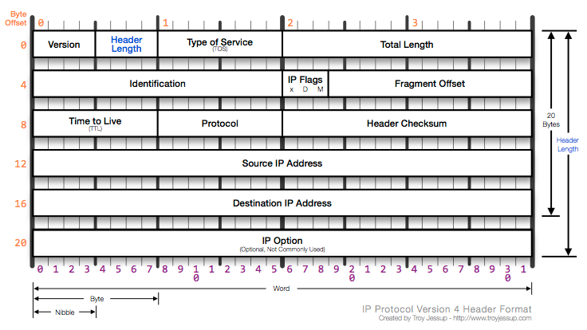

Unidad 2: Configuración y políticas de Firewall
===============================================

:Autores: Emiliano López (emiliano.lopez@gmail.com)

          Maximiliano Boscovich (maximiliano@boscovich.com.ar)

:Fecha: |date| |time|

.. |date| date:: %d/%m/%Y
.. |time| date:: %H:%M

.. header::
  Curso Administracion GNU/Linux

.. footer::
    ###Page### / ###Total###

Protocolo TCP/IP
----------------

La forma que adopta una sección de datos en cualquier capa se denomina Unidad de datos del protocolo (PDU). Durante el **encapsulamiento**, cada capa encapsula las PDU que recibe de la capa superior de acuerdo con el protocolo que se utiliza. Aunque no existe una convención universal de nombres, suelen denominarse:

- Segmento: PDU de la capa de transporte.
- Paquete: PDU de la capa de Internetwork.
- Trama: PDU de la capa de acceso a la red.

.. figure:: imagenes/tcp-ipModel.png
   :align: center
   :scale: 110 %

   Fig. 1 - Proceso de encapsulamiento

La cabecera TCP agrega la siguiente información:

   Fig. 2 - Cabecera TCP

La cabecera IP agrega la siguiente información

   Fig. 3 - Cabecera IP

Firewalls
---------

Un firewall es una pieza de equipo de cómputo con hardware y/o software
que ordena los paquetes entrantes o salientes de la red (que vienen
hacia o desde una red local) y sólo permite el paso de aquellos que
cumplen con ciertas condiciones predefinidas. Para cumplir con su
objetivo, es necesario que el flujo de información entre las redes pase
a través de este, por lo que es muy común encontrarlos delante o como la
puerta de enlace predefinida (Default Gateway) de la red.

   Fig. 4 - El firewall como Gateway

Netfilter: el firewall de GNU/Linux
~~~~~~~~~~~~~~~~~~~~~~~~~~~~~~~~~~~

El núcleo Linux incorpora el firewall netfilter. Este se administra y
controla por medio de los programas iptables e ip6tables, según el tipo
de tráfico que deseemos filtrar (IPv4 o IPv6).

Empecemos desde el principio: Cuando un paquete llega al firewall, 
alcanza el hardware y es procesado en el núcleo por su
driver correspondiente. Después el paquete empieza a recorrer una serie
de etapas en el núcleo antes de ser enviado a la aplicación adecuada
(localmente), reenviado hacia otro host, o cualquier otra operación.
Este conjunto de etapas por las que atraviesa un paquete determinado es
netfilter.

   Fig. 5 - NetFilter

Entender NetFilter es entender como se relacionan 4 conceptos
fundamentales:

-  Tablas

-  Cadenas

-  Reglas

-  Acciones

Las **cadenas** son conjuntos de reglas con un orden determinado, que se
verifican una después de la otra siempre y cuando ninguna se cumpla, es
decir, si una regla se cumple, las siguientes no se evalúan.

Las **tablas** son un conjunto de cadenas que se aplican para tomar una decisión, o
realizar una modificación del flujo de datos en la red, por ejemplo,
filtrar las conexiones entrantes o salientes, aplicar una redirección de
puertos, o marcar paquetes para la priorización de tráfico. Como regla
general, podemos decir que las tablas están compuestas por cadenas, y
las cadenas por reglas, siendo las reglas las que determinar qué se debe
hacer con el tráfico que atraviesa o llega al firewall.

Tablas
^^^^^^

*iptables* cuenta con cuatro tablas, que son zonas en las que una cadena
de reglas se puede aplicar:

-  **Filter**: es la tabla por defecto y se refiere a las reglas de
   filtrado (aceptar, rechazar o ignorar un paquete).

-  **Nat**: se utiliza para la traducción de las direcciones de origen o
   destino de los paquetes, y sus puertos.

-  **Mangle**: se usa en la alteración de los paquetes de red
   especializados, por ejemplo el campo ToS (type of service).

-  **Raw**: permite otras modificaciones manuales en los paquetes antes
   de que lleguen al sistema de seguimiento de conexiones.

Cadenas
^^^^^^^

Como mencionamos anteriormente, las cadenas son agrupaciones de reglas
con un orden predefinido. El firewall utiliza cadenas estándares para
manejar paquetes en función de circunstancias predefinidas. Las mismas
se encuentran asociadas a una tabla particular, siendo las más utilizadas
y las que veremos en este capítulo, la tabla Filter y la tabla NAT:

**Tabla Filter:** contiene 3 cadenas predefinidas, y dependiendo del origen y destino del paquete, el mismo será procesado por alguna de las siguientes:

-  Cadena INPUT: procesará los paquetes cuyo destino es el propio firewall.
-  Cadena OUTPUT: procesará los los paquetes que se generan en el firewall.
-  Cadena FORWARD: procesará los los paquetes que transitan a través del firewall (que no es ni su origen ni su destino).

**Tabla Nat:** contiene 3 cadenas predefinidas, y se utilizan para modificar los paquetes:

-  Cadena PREROUTING: para modificar los paquetes tan pronto como llegan.
-  Cadena POSTROUTING: para modificar los paquetes cuando están listos para seguir su camino.
-  Cadena OUTPUT: para modificar los paquetes generados por el propio firewall.

No abordaremos las tablas mangle y raw ya que su uso excede el contenido
de esta materia, de cualquier modo, los invitamos a seguir investigando
sobre las mismas en la abundante documentación que se encuentra en
internet. A contiuación podemos ver las cadenas pertenecientes a cada tabla y su
orden de evaluación

   Fig. 6 - Cadenas y tablas

Reglas
^^^^^^

Las reglas son conjuntos de condiciones y una acción determinada que se
ejecutará cuando se cumplan dichas condiciones. Cuando se procesa un
paquete, el firewall examina la cadena apropiada, una regla tras otra;
cuando se cumplen las condiciones de una, se aplica la acción
especificada para continuar el procesamiento.

Acciones
^^^^^^^^

Al cumplirse el conjunto de condiciones de una regla, se debe aplicar la
acción asociada a la misma, las que pueden ser:

-  ACCEPT: permitir al paquete seguir su camino. Es decir, si se cumple
   esta regla, el paquete sigue su camino sin que se verifique el resto
   de las reglas de esa tabla.

-  REJECT: rechazar el paquete con un paquete de error ICMP (se informa
   que el paquete ha sido rechazado).

-  DROP: descartar, borrar el paquete. Al igual que REJECT, el paquete
   no sigue su rumbo, pero en este caso no se envía un paquete de error,
   por lo que el emisor no tiene forma de enterarse que ha pasado. El
   paquete simplemente es ignorado.

-  LOG: registrar (a través de syslogd) un mensaje con una descripción
   del paquete. Se debe tener en cuenta que esta acción no interrumpe el
   procesamiento y la ejecución de la cadena continúa con la regla
   siguiente, razón por la que para registrar los paquetes rechazados se
   necesita una regla LOG y una regla REJECT/DROP.

-  ULOG: similar a log, pero el registro es a través de ulogd.

-  NOMBRE_DE_LA_CADENA: saltar a la cadena dada y evalúa sus reglas. Esta
	 acción se utiliza para clasificar el trafico y agrupar paquetes especificos
	 para realizar acciones sobre los mismos de una forma mas ordenada, por ejemplo,
	 agrupar en una cadena todo el tráfico proviniente del exterior con destino
	 a un servidor especifico, o agrupar todo el trafico proviniente de un conjunto
	 de sub redes como pueden ser las redes wifi e intranet.

-  RETURN: interrumpir el procesamiento de la cadena actual y regresar a
   la cadena que la llamó; en el caso de que la cadena actual sea una
   estándar no hay cadena que la haya llamado, por lo que en su lugar se
   ejecutará la acción predeterminada (definida con la opción -P de
   iptables).

Exclusivas de la tabla NAT
''''''''''''''''''''''''''

-  SNAT: aplicar NAT de origen. Básicamente se puede cambiar el ip de
   origen, o el puerto de origen.

-  DNAT: aplicar NAT de destino. Similar a SNAT pero permite modificar
   el puerto de destino y la ip de destino. Su uso más habitual es el
   reenvío de puertos.

-  MASQUERADE: aplicar enmascaramiento (un caso especial de NAT de
   origen).

-  REDIRECT: redirigir un paquete a un puerto determinado del mismo
   firewall. Muy común en la implementación de un proxy web
   transparente.

Orden de evaluación de las cadenas
^^^^^^^^^^^^^^^^^^^^^^^^^^^^^^^^^^

Una vez que una conexión llega al firewall, la misma sigue un camino
predeterminado para recorrer las tablas y cadenas necesarias para su
evaluación. El orden depende principalmente del origen y destino de la
conexión, es decir, desde donde proviene la conexión, y hacia dónde va:

-  Si la conexión se originó en un equipo externo, y su destino es otro
   equipo distinto del firewall: la primer cadena que se evalúa es
   **prerouting**, luego **forward** y por último **postrouting**.

-  Si la conexión se originó en un equipo externo, y su destino es el
   firewall (por ejemplo si desde un equipo nos queremos conectar al
   firewall vía ssh): la primer cadena que se evalúa es **prerouting**
   y luego **input**.

-  Si la conexión se originó en el firewall, las cadenas que se evalúan
   son **output** y luego **postrouting**.

   Fig. 7 - Orden de evaluación de las cadenas

Por esta razón, si queremos filtrar las conexiones entrantes o salientes
a nuestra red, el firewall debe estar necesariamente en medio como
mencionamos previamente.

Sintaxis de iptables
~~~~~~~~~~~~~~~~~~~~

Los programas iptables e ip6tables permiten manipular las tablas,
cadenas y reglas. Sus parámetros más utilizados son:

Parámetros:
^^^^^^^^^^^

-  La opción **-t tabla** : indica en qué tabla operar (la tabla filter
   de forma predeterminada).

-  La opción **-N cadena**: crea una nueva cadena.

-  La opción **-X cadena** : elimina una cadena vacía y sin uso.

-  La opción **-A cadena regla**: añade una regla al final de la cadena dada.

-  La opción **-I cadena número_regla regla**: inserta una regla antes de la regla con
   número *número_regla*.

-  La opción **-D cadena número_regla** (o -D *cadena regla*) : elimina una
   regla en una cadena, la primera sintaxis identifica la regla que se desea
   eliminar por su número, mientras que la segunda la identifica por su contenido.

-  La opción **-F cadena** : vacía una cadena (borra todas sus reglas), si no
   menciona ninguna cadena, eliminará todas las reglas de la tabla.

-  La opción **-L cadena** : muestra las reglas de la cadena.

-  Por último, la opción **-P cadena acción** define la acción predeterminada
   o "política" para una cadena dada; tenga en cuenta que sólo las cadenas estándar
   puede tener dicha política.

Es importante que mencionemos las políticas por defecto de un firewall.
Estas pueden ser de dos tipos:

-  Aceptar por defecto.

-  Rechazar por defecto.

El tipo de política cambia completamente el comportamiento de nuestro
firewall, dado que por ejemplo si deseamos solamente bloquear un
conjunto de puertos determinados, lo recomendable es utilizar como
política por defecto "Aceptar", de modo que solo tengamos que agregar
las reglas específicas para bloquear el tráfico no deseado. Por el
contrario, la política de “Rechazar por defecto” es la más segura, pero
exige que tengamos un entendimiento mayor de nuestra red y su uso,
principalmente porque al negar todo por defecto, debemos habilitar uno a
uno los diferentes tipos de tráfico que deseamos permitir, y esto
incluye conocer con detenimiento el uso que se hace de nuestra red, para
evitar que la misma quede sin servicio (por ejemplo debemos permitir el
acceso al servicio de DNS, navegación, uso de ftp, ssh, ntp, etc.).

Veamos un ejemplo sencillo: supongamos que nuestra política de seguridad
establece que solamente se debe bloquear el tráfico smtp saliente de
nuestra red (red 10.0.0.0/24), para todos los usuarios excepto para el
servidor de correos cuya IP es 10.0.0.4. A continuación presentamos la
topología

   Fig. 8 - Ejemplo de red con firewall como gateway

En este caso nos conviene utilizar como política por defecto a
"Aceptar", y solo agregar las reglas pertinentes que cumplan con lo
establecido. Para este caso, el conjunto de reglas sería el siguiente:

.. code:: bash

    # Definimos la política por defecto en Aceptar

    iptables -P INPUT ACCEPT
    iptables -P OUTPUT ACCEPT
    iptables -P FORWARD ACCEPT

    # El servidor de correos interno puede salir al puerto TCP 25 (SMTP)

    iptables -t filter -A FORWARD -s 10.0.0.4 -p tcp --dport 25 -j ACCEPT

    # El resto de la red no puede salir al puerto TCP 25

    iptables -t filter -A FORWARD -s 10.0.0.0/24 -p tcp --dport 25 -j REJECT

Es importante resaltar que las reglas fueron anexadas a la tabla *forward*
debido a que el origen y el destino son distintos del
firewall (origen: equipos de la red interna, destino: equipos de otras
redes). A su vez, el orden en el que se evalúan las reglas es secuencial
(recuerden que la opción -A agrega las reglas al final de la cadena)
motivo por el cual primero permitimos la salida del servidor de correos
y luego si denegamos el resto de la red. Otro detalle importante es que
este conjunto de reglas se aplica y permanece en memoria, por lo que si
el servidor se reinicia las mismas se pierden. Lo recomendable es
guardarlas dentro de un script de bash, y ejecutar el mismo
automáticamente al inicio, o luego de levantar las interfaces de red,
como veremos más adelante.

Analicemos un poco más en detalle las reglas.

Reglas
^^^^^^

Cada regla es expresada como **condiciones -j acción opciones_acción**.
Si describe varias condiciones en la misma regla, entonces el criterio es
la conjunción ("y" lógico) de las condiciones, que son al menos tan restrictivas
como cada condición individual. Por ejemplo:

.. code:: bash

  iptables -t filter -A  FORWARD -s 10.0.0.4 -p tcp --dport 25 -j ACCEPT

En este caso las condiciones son 3:

- El origen (source) tiene que ser el host cuya IP es 10.0.0.4 .

- El protocolo tiene que ser TCP.

- El puerto de destino tiene que ser el 25.

La condición **-p protocolo** coincide con el campo de protocolo del paquete IP,
y los valores más comunes son **tcp, udp, icmp e icmpv6**. Anteponer la
condición con un signo de exclamación niega la condición, la cual equivale a
"todos los paquetes cuyo origen no sea la ip 10.0.0.4".

.. code:: bash

  iptables -t filter -A FORWARD ! -s 10.0.0.4 -p tcp --dport 25 -j DROP

Este mecanismo de negación no es específico de la opción -s y se puede aplicar
a todas las otras condiciones también. La condición **-s dirección** ó
**-s red/máscara** coincide con la dirección de origen del paquete. De igual
manera, **-d dirección** ó **-d red/máscara** coincide con la dirección de
destino.

La condición **-i interfaz** selecciona los paquetes
procedentes de la interfaz de red dada y **-o interfaz** selecciona los paquetes que salen a través de una interfaz específica.

Hay condiciones más específicas, dependiendo de las condiciones genéricas descriptas
anteriormente. Por ejemplo, puede complementar la condición **-p tcp** con condiciones sobre
los puertos TCP, cláusulas como **--source-port puerto** y **--destination-port puerto**.
La condición **--state estado** coincide con el estado de un paquete en una conexión.
El estado NEW describe un paquete que inicia una nueva conexión; ESTABLISHED coincide con paquetes
pertenecientes a una conexión ya existente y RELATED coincide con paquetes iniciando una
nueva conexión relacionada con una ya existente (lo cual es útil para las conexiones ftp-data
en el modo «activo» del protocolo FTP).

Veamos ahora un poco las opciones disponibles
por cada acción. Por ejemplo, la acción LOG tiene las siguientes opciones: **--log-priority**, con un
valor predeterminado de warning, indica la severidad de los mensajes
syslog; **--log-prefix** permite especificar un prefijo de texto para
diferenciar los mensajes registrados; **--log-tcp-sequence**,
**--log-tcp-options** y **--log-ip-options** indican datos
adicionales que se integrarán en el mensaje: el número de secuencia TCP,
opciones TCP y las opciones IP, respectivamente. La acción DNAT ofrece
la opción **--to-destination dirección:puerto** para indicar la
nueva dirección IP y/o puerto de destino. De manera similar, SNAT
proporciona **--to-source dirección:puerto** para indicar la nueva
dirección IP y/o puerto de origen. La acción REDIRECT ofrece la opción
**--to-ports puerto(s)** para indicar el puerto o rango de puertos al
que debe redirigir los paquetes.

Ejemplo práctico
~~~~~~~~~~~~~~~~

Siguiendo con el ejemplo de la red anterior. Supongamos ahora que la
política de seguridad establece que se debe bloquear todo el tráfico
saliente, ha excepción de los siguientes servicios:

-  Web

-  IMAP y IMAPs

-  DNS (se usarán los servidores DNS provistos por el proveedor de
   internet)

-  SSH (solo al firewall desde la red interna)

-  SMTP (solo el servidor de correos)

Dado que los equipos en la red interna tienen direccionamiento IP
privado, necesariamente tienen que ser enmascarados (NAT) para poder
salir a internet con la dirección IP del firewall, que en este caso es
el default gateway. El conjunto de reglas sería el siguiente:

.. code:: bash

    #!/usr/bin/env bash

    # Definimos la política por defecto en DROP

    iptables -P INPUT DROP
    iptables -P OUTPUT DROP
    iptables -P FORWARD DROP

    # El servidor de correos interno puede salir al puerto TCP 25 (SMTP) 
    # y TCP 465 (SMTPs)

    iptables -t filter -A FORWARD -s 10.0.0.4 -p tcp --dport 25 -j ACCEPT
    iptables -t filter -A FORWARD -s 10.0.0.4 -p tcp --dport 465 -j ACCEPT

    # Desde la subred local se puede salir a los puertos TCP 80(HTTP),443(HTTPs),
    # 143(IMAP), 993(IMAPs), 110(POP3), 995(POP3s), 53(DNS) y UDP 53 (DNS).

    iptables -t filter -A FORWARD -s 10.0.0.0/24 -p tcp --dport 80 -j ACCEPT
    iptables -t filter -A FORWARD -s 10.0.0.0/24 -p tcp --dport 443 -j ACCEPT
    iptables -t filter -A FORWARD -s 10.0.0.0/24 -p tcp --dport 143 -j ACCEPT
    iptables -t filter -A FORWARD -s 10.0.0.0/24 -p tcp --dport 993 -j ACCEPT
    iptables -t filter -A FORWARD -s 10.0.0.0/24 -p tcp --dport 110 -j ACCEPT
    iptables -t filter -A FORWARD -s 10.0.0.0/24 -p tcp --dport 995 -j ACCEPT
    iptables -t filter -A FORWARD -s 10.0.0.0/24 -p tcp --dport 53 -j ACCEPT
    iptables -t filter -A FORWARD -s 10.0.0.0/24 -p udp --dport 53 -j ACCEPT

    # Acceso SSH al firewall

    iptables -t filter -A INPUT -s 10.0.0.0/24 -p tcp --dport 22 -j ACCEPT

    # A su vez necesitamos que desde el firewall también se acceda a 
    # los servidores DNS

    iptables -t filter -A OUTPUT -s 10.0.0.1 -p tcp --dport 53 -j ACCEPT
    iptables -t filter -A OUTPUT -s 10.0.0.1 -p udp --dport 53 -j ACCEPT

    # Se enmascaran todas las conexiones para que cuando salga a
    # internet lo hagan con la IP pública del firewall

    iptables -t nat -A POSTROUTING -o eth1 -s 10.0.0.0/24 -j MASQUERADE

Como vemos, una política de seguridad muy simple se convierte en varias
reglas de iptables, las que como mencionamos previamente, deben estar en
un script de bash que se ejecute al inicio y las aplique, porque sino al
reiniciar el sistema se perderán. Hay varias estrategias para conseguir
esto, pero una de las más utilizadas es ejecutar este script de bash al
levantar la interfaz interna, por ejemplo. Para esto debemos guardar el
script con todas las reglas de iptables en
/usr/local/etc/mi_firewall.fw, y por medio del parámetro "up" en el
archivo /etc/network/interfaces invocarlo

.. code:: bash

    auto eth0

    iface eth0 inet static
        address 10.0.0.1
        network 10.0.0.0
        netmask 255.255.255.0
        broadcast 10.0.0.255
        up /usr/local/etc/mi_firewall.fw
        down /usr/local/etc/mi_firewall-clean.fw

Del mismo modo que existe parámetro "up", existe el parámetro "down" que
sirve para invocar un script cada vez que se baja una interfaz. Es
interesante para poder limpiar todas las reglas antes de aplicarlas
nuevamente (supongamos que cambiamos el script y queremos aplicar
nuevamente las reglas) . Un ejemplo del script "mi_firewall-clean.fw"
es el siguiente

.. code:: bash

    #! /usr/bin/env bash

    cat /proc/net/ip_tables_names | while read table; do
      iptables -t $table -L -n | while read c chain rest; do
          if test "X$c" = "XChain" ; then
            iptables -t $table -F $chain
          fi
      done
      iptables -t $table -X
    done

Básicamente lo que hace este script es obtener todas las tablas
definidas (que contengan reglas) y limpiarlas por medio del parámetro
-F.
De este modo si cambiamos las reglas modificando el script, simplemente bajando
y volviendo a subir la interfaz, estaríamos aplicando dicha regla.

Simplificando la creación de reglas con FWBuilder
~~~~~~~~~~~~~~~~~~~~~~~~~~~~~~~~~~~~~~~~~~~~~~~~~

Si bien es importante tener claros los conceptos y entender como
funciona iptables con todas sus opciones, a la hora de trabajar a diario
e implementar una política de seguridad extensa, con muchas reglas,
varias subredes, equipos, etc; escribir a mano estas órdenes se vuelve
algo tedioso. Lo recomendable es utilizar una herramienta de alto nivel
como fwbuilder. El principio que persigue esta herramienta es simple. En
el primer paso es necesario describir todos los elementos que
intervendrán en las reglas:

-  el propio firewall, con sus interfaces de red;

-  las redes, con sus rangos de direcciones IP correspondientes;

-  los servidores;

-  los puertos pertenecientes a los servicios alojados en los
   servidores.

Luego puede crear las reglas simplemente arrastrando y soltando acciones
en los objetos. Unos cuantos menús contextuales pueden cambiar la
condición (negarla, por ejemplo). A continuación, deberá elegir la
acción, configurarla y listo.

   Fig. 9 - Generación de reglas con FWBuilder

Luego fwbuilder puede generar un script de configuración del firewall
según las reglas que definió. Su arquitectura
modular le da la capacidad para generar scripts dirigidos a diferentes
sistemas (iptables para Linux, ipf para FreeBSD y pf para OpenBSD).

En la imagen anterior se ve el ejemplo del firewall que configuramos
anteriormente.

